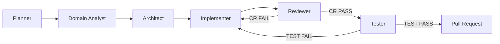
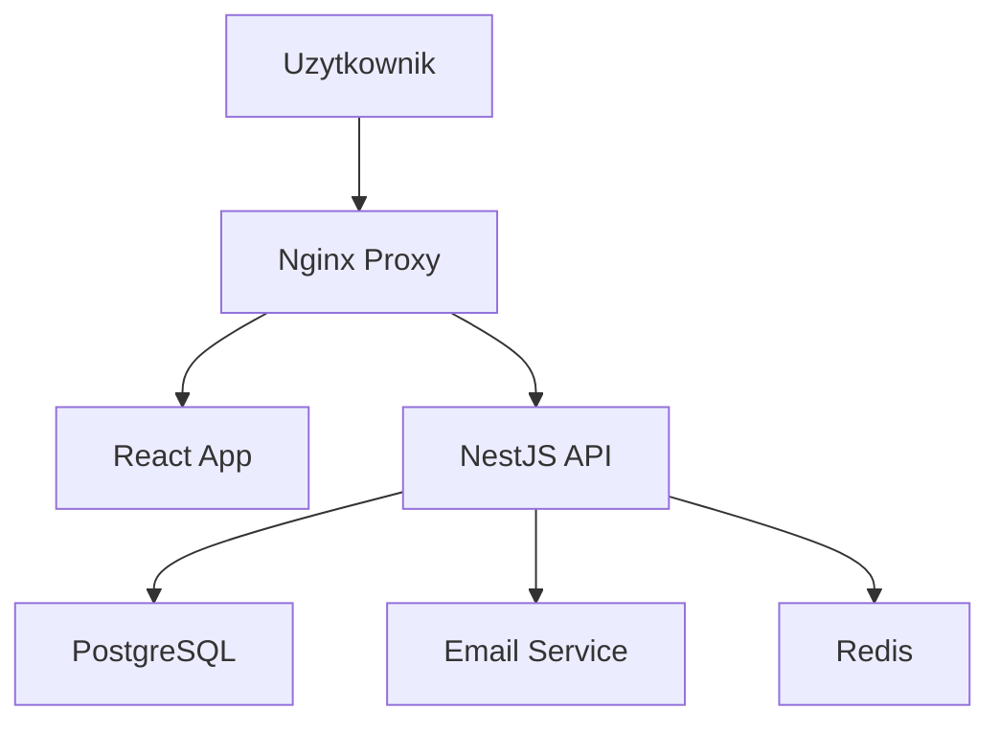

# Inteligentny System Rezerwacji Stolików Restauracyjnych

## Kontekst projektu

Nowoczesna platforma do zarządzania rezerwacjami w restauracjach w czasie rzeczywistym. System pozwala klientom na szybki wybór dostępnych stolików, a właścicielom lokali na optymalizację obłożenia sali. Celem projektu jest eliminacja błędów w rezerwacjach oraz automatyzacja procesu potwierdzeń.

**Szacowany czas realizacji:** 3 miesiące

## Stos technologiczny

| Warstwa | Technologia |
|---------|-------------|
| Język | TypeScript |
| Framework | NestJS (Backend), React (Frontend) |
| Baza danych | PostgreSQL |
| Hosting | Dockerized VPS / AWS |

---

## Model pracy: Agents Teams Pipeline

Projekt używa modelu **Agents Teams** — każde zadanie przechodzi przez sekwencyjny pipeline specjalistów. Żaden etap nie może zostać pominięty.



### Agenci fazowi (pipeline)

| # | Agent | Rola |
|---|-------|------|
| 1 | `planner` | Rozkłada issue na kroki, tworzy plan implementacji |
| 2 | `domain-analyst` | Analizuje wymagania biznesowe, edge case'y, ryzyka |
| 3 | `architect` | Projektuje rozwiązanie techniczne (pliki, API, modele danych) |
| 4 | `implementer` | Koordynuje kodowanie — deleguje do agentów domenowych |
| 5 | `code-reviewer` | Przegląd kodu: poprawność, bezpieczeństwo, jakość |
| 6 | `tester` | Weryfikacja testów i kryteriów akceptacji |

### Agenci domenowi (używani wewnętrznie przez Implementera)

| Agent | Kiedy |
|-------|-------|
| `backend-dev` | zadania Backend / Baza danych |
| `frontend-dev` | zadania Frontend |
| `devops` | zadania DevOps |

#### Mapowanie kategorii → agent domenowy

  - label `Backend` → agent `backend-dev`
  - label `DevOps` → agent `devops`
  - label `Frontend` → agent `frontend-dev`
  - label `Testowanie` → agent `tester`

---

## Workflow realizacji zadania

### Krok 1 — Pobierz zadanie

```bash
gh issue list --state open --label "priority:High" --json number,title,labels,body
# Jeśli brak High, sprawdź Medium, potem Low
```

Wybierz jedno zadanie. Przeczytaj jego treść: opis + kryteria akceptacji.

### Krok 2 — Utwórz branch

```bash
ISSUE_NUMBER=<numer>
SLUG=$(echo "<tytuł>" | tr '[:upper:]' '[:lower:]' | sed 's/[^a-z0-9]/-/g' | cut -c1-40)
git checkout -b feature/issue-${ISSUE_NUMBER}-${SLUG}
```

### Krok 3 — Planner

Uruchom agenta `planner`. Przekaż mu:
- Pełną treść issue (opis + kryteria akceptacji)
- Stos technologiczny (patrz tabela powyżej)

Wynik: szczegółowy plan implementacji → przekaż do Domain Analyst.

### Krok 4 — Domain Analyst

Uruchom agenta `domain-analyst`. Przekaż mu:
- Treść issue
- Plan z Plannera

Wynik: analiza wymagań biznesowych, edge case'ów i ryzyk → przekaż do Architekta.

### Krok 5 — Architect

Uruchom agenta `architect`. Przekaż mu:
- Plan z Plannera
- Analizę z Domain Analyst

Wynik: projekt techniczny (pliki, endpointy, modele danych, kontrakty) → przekaż do Implementera.

### Krok 6 — Implementer

Uruchom agenta `implementer`. Przekaż mu:
- Projekt techniczny z Architekta
- Numer issue i treść kryteriów akceptacji

Implementer deleguje do odpowiedniego agenta domenowego (`backend-dev` / `frontend-dev` / `devops`) zgodnie z tabelą mapowania.

Wynik: zaimplementowany kod + podsumowanie zmian.

### Krok 7 — Reviewer

Uruchom agenta `code-reviewer`. Przekaż mu:
- diff zmian (`git diff main`)
- treść issue z kryteriami akceptacji

**Kontynuuj tylko przy ✅ CR PASS lub ⚠️ CR PASS WITH NOTES.**
Przy ❌ CR FAIL — wróć do Kroku 6 (Implementer) z listą problemów.

### Krok 8 — Tester

Uruchom agenta `tester`. Przekaż mu:
- kryteria akceptacji z issue
- zmienione pliki
- instrukcje uruchomienia testów

**Kontynuuj tylko przy ✅ TEST PASS.**
Przy ❌ TEST FAIL — wróć do Kroku 6 (Implementer) z informacją o failujących testach.

### Krok 9 — Utwórz Pull Request

```bash
gh pr create \
  --title "feat: <tytuł zadania> (closes #<numer>)" \
  --body "## Co zostało zrobione
<podsumowanie zmian>

## Powiązane issue
Closes #<numer>

## Agents Teams Pipeline
- ✅ Planner: plan implementacji
- ✅ Domain Analyst: analiza wymagań
- ✅ Architect: projekt techniczny
- ✅ Implementer: kod wdrożony
- ✅ Reviewer: CR PASS
- ✅ Tester: TEST PASS

## Zmiany
<lista zmodyfikowanych plików>"
```

### Krok 10 — Następne zadanie

Po merge wróć do Kroku 1 i pobierz kolejne zadanie.

---

## Definition of Done

Każde zadanie uważaj za ukończone gdy:

- Kod przeszedł proces Code Review
- Wszystkie testy jednostkowe i integracyjne przechodzą pomyślnie
- Dokumentacja API w Swaggerze jest aktualna
- Aplikacja jest w pełni skonteneryzowana i uruchamia się przez docker-compose
- Interfejs frontendowy jest responsywny i zgodny z makietami
- Wszystkie User Stories zostały zweryfikowane i zaakceptowane
- Brak krytycznych błędów (Bugs) w backlogu
- Zmienne środowiskowe są poprawnie zdefiniowane w pliku .env.example

---

## Ryzyka projektu

- **High** Double booking - dwóch użytkowników rezerwuje ten sam stolik w tej samej milisekundzie. → Zastosowanie transakcji bazodanowych z poziomem izolacji SERIALIZABLE oraz blokad (locks) na wierszach tabeli stolików.
- **Medium** Ataki botów tworzące tysiące fałszywych rezerwacji. → Wprowadzenie reCAPTCHA w formularzu rezerwacji oraz limitowanie liczby żądań (Rate Limiting) na poziomie API.
- **Medium** Awaria bazy danych prowadząca do utraty danych o rezerwacjach. → Konfiguracja automatycznych backupów codziennych oraz wdrożenie strategii odtwarzania danych (Disaster Recovery).
- **Low** Niska wydajność przy dużym ruchu w godzinach szczytu. → Wprowadzenie cache'owania dostępnych stolików w Redis oraz optymalizacja zapytań SQL.

---

## Architektura


